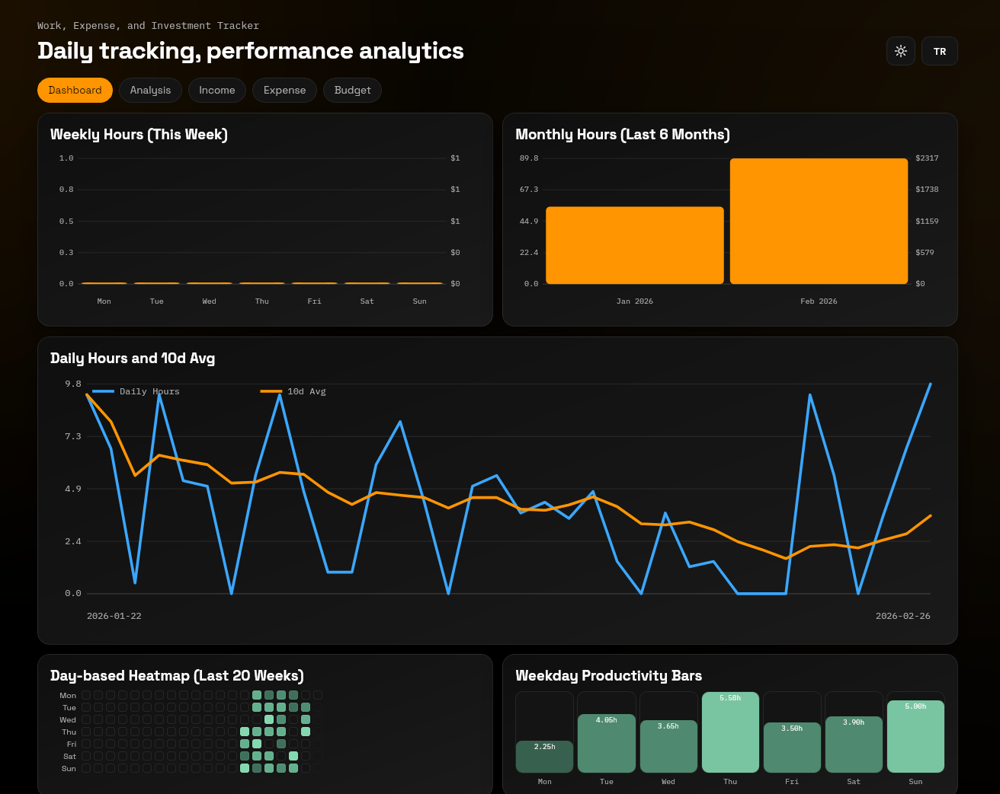
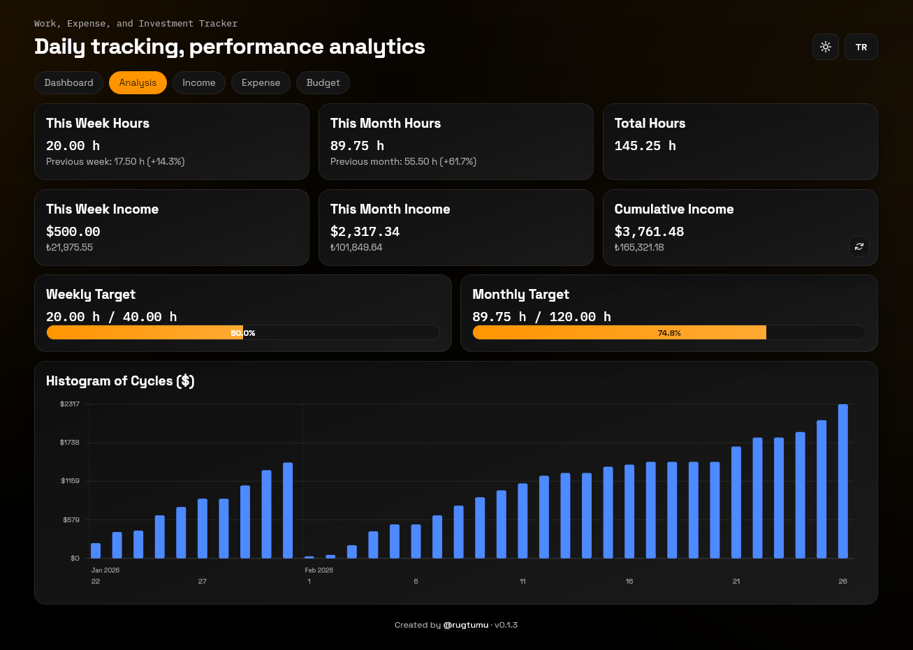

# Freelance Timeboard

Günlük çalışma, gelir/gider, investment/trade takibi uygulaması.

## Özellikler
- `Panel` sekmesi: haftalık/aylık saat grafikleri, günlük saat + rolling ortalama, heatmap
- `Analiz` sekmesi: KPI kartları, hedef takibi ve cycle histogram
- `Gelir` sekmesi: günlük saat/gelir kaydı ekleme, düzenleme, silme
- `Gider` sekmesi: USD/TRY para birimi ile gider girişi, düzenleme, silme
- `Bütçe` sekmesi: toplam gelir, toplam gider, net bakiye ve kategori bazlı gider özeti
- Koyu/Açık tema ve TR/EN dil desteği
- USD/TRY manuel giriş + canlı kur yenileme
- CSV içe aktarma
- CSV dışa aktarma

## Veri Katmanı
- Tauri (desktop):
  - Gelir kayıtları, gider kayıtları ve ayarlar: SQLite
- Web fallback: localStorage

## Kurulum
1. `npm install`
2. Web geliştirme: `npm run dev`
3. Desktop geliştirme: `npm run tauri:dev`

## Build
- Web: `npm run build`
- Desktop: `npm run tauri:build`

## CSV İçe Aktarma
1. `Gelir` sekmesine geç.
2. `CSV İçe Aktar` butonuna tıkla.
3. CSV dosyasını seç.
4. Mevcut kayıtları değiştirme onayını ver.

## CSV Dışa Aktarma
- `Gelir` sekmesindeki `CSV Dışa Aktar` ile dosya kaydedilir.
- Tauri ortamında dosya önce `Downloads`, bulunamazsa `Desktop`, o da yoksa uygulama veri dizinine yazılır.

## Notlar
- Canlı USD/TRY çekimi ağ erişimine bağlıdır; başarısız olursa manuel değer kullanılabilir.
- Güncelleme yaparken `identifier` ve `productName` sabit tutulursa kullanıcı verileri korunur.

## Lisans
- Bu proje `Freelance Timeboard Non-Commercial License v1.0` ile lisanslanmıştır.
- Ticari kullanım yasaktır.
- Ticari kullanım için ayrı yazılı izin/lisans alınmalıdır.
- Detaylar için [LICENSE](/home/umut/Documents/Projects/freelance-timeboard/LICENSE) dosyasına bakın.
