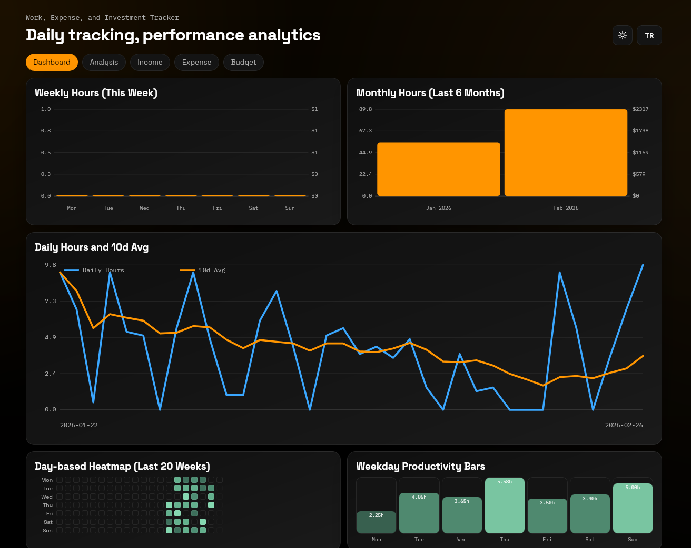
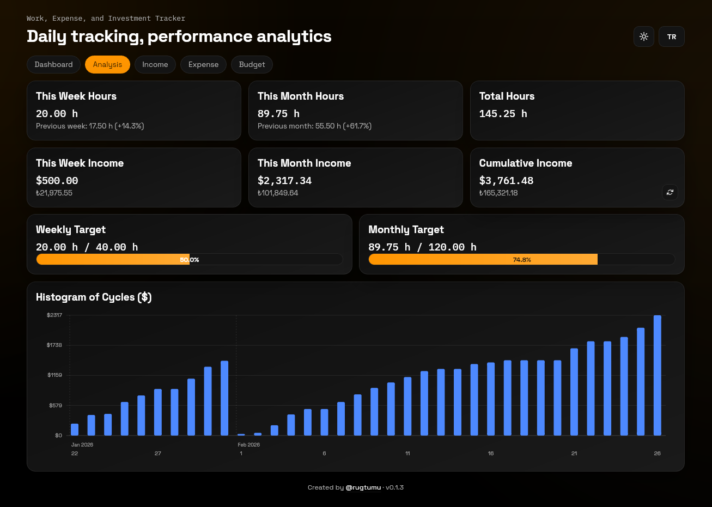

# Freelance Timeboard

Günlük çalışma, gelir/gider ve yatırım takibi için Tauri + Vite tabanlı masaüstü uygulaması.

## Özellikler
- `Panel` sekmesi: haftalık/aylık saat grafikleri, günlük saat + rolling ortalama, heatmap
- `Analiz` sekmesi: KPI kartları, hedef takibi ve cycle histogram
- `Clock/Lead` sekmesi: clock-in ve lead time girişi, risk bandı hesaplama
- `Veri` sekmesi: Gelir/Gider alt sekmeleri, hızlı giriş, CSV içe/dışa aktarma
- `Yatırım` sekmesi: varlık listesi, filtreleme + tablo başlığından sıralama, performans metrikleri
- `Bütçe` sekmesi: toplam gelir/gider, net bakiye ve kategori bazlı gider dağılımı
- `Ayarlar` sekmesi:
  - Genel ayarlar (USD/saat, USD/TRY, hedefler, dil)
  - Borsa API anahtarları (keyring + şifreli vault fallback)
  - Sekme görünürlüğü (veriyi silmeden gizle/göster)
- Koyu/Açık tema ve TR/EN dil desteği
- USD/TRY manuel giriş + canlı kur yenileme

## Veri ve Güvenlik
- Desktop (Tauri): Gelir, gider ve ayarlar SQLite üzerinde tutulur.
- Web fallback: localStorage.
- API anahtarları:
  - Öncelik OS keyring.
  - Keyring yoksa şifreli vault (app data dir) kullanılır.
  - Vault parolası uygulama her açıldığında tekrar girilir, **saklanmaz**.
  - Repo’ya API anahtarı yazılmaz, ayarlarda sadece maskeli görünür.

## Kurulum
1. `npm install`
2. Web geliştirme: `npm run dev`
3. Desktop geliştirme: `npm run tauri:dev`

## Build
- Web: `npm run build`
- Desktop: `npm run tauri:build`
- Android APK: `npm run tauri:android:build`

## Android (APK)
1. Android SDK + NDK kurulu olmalı:
   - `ANDROID_HOME` ve `ANDROID_SDK_ROOT` ayarlı olmalı.
   - `NDK_HOME` doğru NDK dizinini göstermeli (ör. `~/Android/Sdk/ndk/29.0.13846066`).
2. Android init:
   - `npm run tauri:android:init`
3. Geliştirme (cihaz bağlıyken):
   - `adb devices` ile cihaz görünmeli.
   - `npm run tauri:android:dev`
4. APK build:
   - `npm run tauri:android:build`

## Android Cleanup (Memory)
- Gradle/Kotlin daemonlarını kapatmak için:
  - `npm run android:cleanup`

### Android Notları
- Telefon ve bilgisayar aynı ağda olmalı (dev server için).
- Gerekirse Vite host: `server.host = true`.
- Emülatör açılmazsa fiziksel cihaz daha stabil olabilir.

## CSV İçe Aktarma
1. `Veri` → `Gelir` (veya `Gider`) sekmesine geç.
2. `CSV İçe Aktar` butonuna tıkla.
3. CSV dosyasını seç.
4. Mevcut kayıtları değiştirme onayını ver.

## CSV Dışa Aktarma
- `Veri` sekmesindeki `CSV Dışa Aktar` ile dosya kaydedilir.
- Tauri ortamında dosya önce `Downloads`, bulunamazsa `Desktop`, o da yoksa uygulama veri dizinine yazılır.

## Notlar
- Canlı USD/TRY çekimi ağ erişimine bağlıdır; başarısız olursa manuel değer kullanılabilir.
- Güncelleme yaparken `identifier` ve `productName` sabit tutulursa kullanıcı verileri korunur.

## Lisans
- Bu proje `Freelance Timeboard Non-Commercial License v1.1` ile lisanslanmıştır.
- Ticari kullanım yasaktır.
- Ticari kullanım için ayrı yazılı izin/lisans alınmalıdır.
- Detaylar için [LICENSE](/LICENSE) dosyasına bakın.
